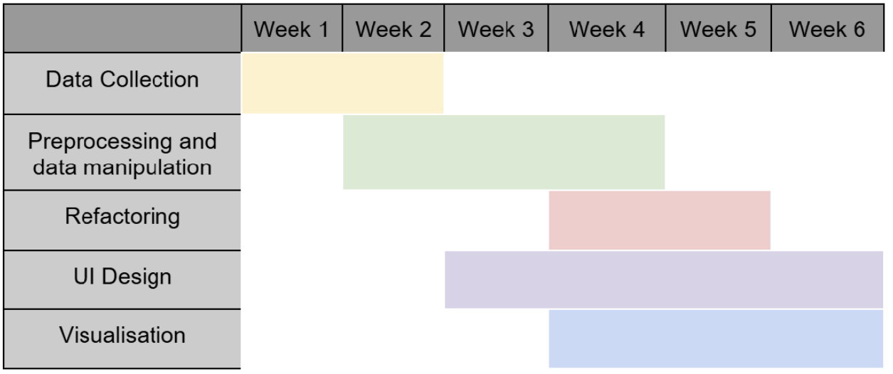

# CRISPR-Guide-RNA-Design-Tool

<p align="center">
 

</p>

## Description

Castor is a tool designed to simplify the gRNA design process in Clustered Regularly Interspaced Short Palindromic Repeats (CRISPR)-associated protein 9 (Cas9) projects. The platform identifies gRNA sequences from input FASTA files based on specified PAM patterns and ranks them by predicted performance using a pre-trained ML model. The outputs include **predicted efficacy scores** for guide RNAs (gRNAs), **annotated gRNA data with biological features** (e.g., Minimized Free Energy, Average Base-Pairing probability, Ensemble Energy), and visualizations such as **feature plots distributions**, feature correlations. The results are saved to a CSV file for further analysis, and detailed logs ensure reproducibility and debugging support.

----
## Functionalities

This Python-based pipeline is designed for CRISPR guide RNA (gRNA) analysis. It utilizes Pandas and NumPy for data handling, ViennaRNA (RNA module) for RNA secondary structure prediction, and Plotly for interactive visualizations. A machine learning ensemble model, combining Random Forest and XGBoost, predicts gRNA efficacy based on extracted RNA structural and sequence-based features, including minimum free energy (MFE), base-pairing probabilities, ensemble free energy, and helical structure properties.

## Data Sources and Processing

### Model Creation
To develop the model, we utilized a curated dataset sourced from various databases and publications. The dataset is stored in a CSV file containing two primary columns: 
- **gRNA sequences**: The guide RNA sequences.
- **Efficacy scores**: The corresponding efficacy scores for each gRNA sequence.

The gRNA sequences were enriched with biological features and encoded using one-hot encoding to create a comprehensive feature matrix. This matrix served as the input for our machine learning model.

We employed a **Stacking-Ensemble regressor model**, which combines the strengths of **Random Forest** and **XGBoost** algorithms, to predict the efficacy scores based on the input features.

### User Input Processing
For user input, the model accepts a single FASTA sequence. The sequence is processed as follows:
1. **Sequence Breakdown**: The input sequence is divided into 23-mer subsequences, each ending with a **PAM sequence**.
2. **Feature Extraction**: The same biological features used during model training are calculated for each 23-mer subsequence.
3. **Prediction**: The pre-trained Stacking-Ensemble regressor model is then used to predict the efficacy scores for each subsequence.

This pipeline ensures accurate and efficient prediction of gRNA efficacy based on user-provided sequences.

## Data Storage and Structure

### Training Data
The original dataset used for training the model is stored as a CSV file in the local directory. The file contains two columns:
- **gRNA**: The guide RNA sequences.
- **Efficacy Scores**: The corresponding efficacy scores for each gRNA.

### Prediction Results
The results generated after running predictions are also saved locally on the system for easy access and downloading.

### User Account Credentials
User account credentials are securely stored on a Firebase server. All sensitive information is encrypted to ensure data privacy and security.

For more details, refer to the code and documentation in the repository.
## User Interface and Accessibility
A **Streamlit**-based web application provides a user-friendly interface for:

- Uploading FASTA files
- Customizing experimental parameters
- Viewing and downloading predictions
This ensures accessibility for both computational and experimental researchers.
## Statistical Analysis and Model Performance
The efficacy prediction relies on robust statistical techniques and machine learning models. Metrics such as regression accuracy and feature importance are computed to validate model performance across multiple datasets.

## Visualizations
Comprehensive visualizations using Plotly include:
- Histograms + Boxplots for predicted efficacy score distributions
- Correlation heatmaps of biological and structural features
- Feature importance plots highlighting key contributors to gRNA efficacy

This pipeline provides an efficient and interpretable framework for gRNA efficacy prediction and CRISPR guide design.

----
## Installation and Usage

To set up and run this pipeline, follow these steps:  

1. **Clone the GitHub Repository**:  
   ```bash
   git clone <repository_url>
   cd <repository_directory>
    ```
2. **Install Dependencies**:
The required dependencies are listed in the provided dependencies file. Install them using:
 ```bash
  pip install -r requirements.txt
 ```
----
## Timeline

## Group Details
Example:
- Group name: CRISPR
- Group code: G18
- Group repository: https://github.com/bsa674/CRISPR-Guide-RNA-Design-Too
- Tutor responsible: Frederik Hennecke
- Group team leader: Samanta Bishal
- Group members and contribution:

**Samanta Bishal**: Project Lead, organization, machine Learning development, and database curation
**Mateo Carvajal**: Assisted in searching and compiling the database for model training, code for the model's usage and visualization.
**Zeynep Aslan**: Helped in database curation and  developed the code for model usage, including prediction and visualization tools.
**Pablo Alarcón**: User-friendly web interface, user account management, including authentication and user profile systems
**Raghvendra Agrawal**: User-friendly web interface, helped implemented statistical analysis and dynamic visualization features for the web interface.

## Acknowlegdments

- Streamlit - Web application framework for creating interactive data app
- Documentation: https://docs.streamlit.io/
- Pandas - Data manipulation and analysis library.
- Documentation: https://pandas.pydata.org/
- Matplotlib and Seaborn - Libraries for data visualization in Python.
- Matplotlib: https://matplotlib.org/
- Seaborn: https://seaborn.pydata.org/
- scikit-learn - Machine learning library for Python.
- Documentation: https://scikit-learn.org/
- XGBoost - Scalable machine learning library for gradient boosting.
Documentation: https://xgboost.readthedocs.io/

## Data Repositories & Resources
1) ENCODE (Encyclopedia of DNA Elements)
Website: https://www.encodeproject.org/
2) CRISPRBase - Repository for CRISPR research data.
Website: https://www.crisprbase.com/
3) GEO (Gene Expression Omnibus) - Database for functional genomics data.
Website: https://www.ncbi.nlm.nih.gov/geo/
4) SRA (Sequence Read Archive) - Repository for raw sequencing data.
Website: https://www.ncbi.nlm.nih.gov/sra
5) Figshare - General-purpose repository for scientific datasets.
Website: https://figshare.com/


## Relevant Publications
1) Chen, Y., & Wang, X. (2022). Evaluation of efficiency prediction algorithms and development of ensemble model for CRISPR/Cas9 gRNA selection. Bioinformatics, 38(23), 5175-5181.
DOI: https://doi.org/10.1093/bioinformatics/btac681
2) Doudna, J.A., & Charpentier, E. (2014). The new frontier of genome engineering with CRISPR-Cas9. Science, 346(6213), 1258096.
DOI: https://doi.org/10.1126/science.1258096
3) Doench, J.G., et al. (2016). Optimized sgRNA design to maximize activity and minimize off-target effects of CRISPR-Cas9. Nature Biotechnology, 34, 184-191.
DOI: https://doi.org/10.1038/nbt.3437
4) Konstantakos, V., et al. (2022). CRISPR-Cas9 gRNA efficiency prediction: an overview of predictive tools and the role of deep learning. Nucleic Acids Research, 50, 3616-3637.
DOI: https://doi.org/10.1093/nar/gkab1114
5) Kim, H.K., et al. (2019). SpCas9 activity prediction by DeepSpCas9, a deep learning-based model with high generalization performance. Science Advances, 5(11), eaax9249.
DOI: https://doi.org/10.1126/sciadv.aax9249
